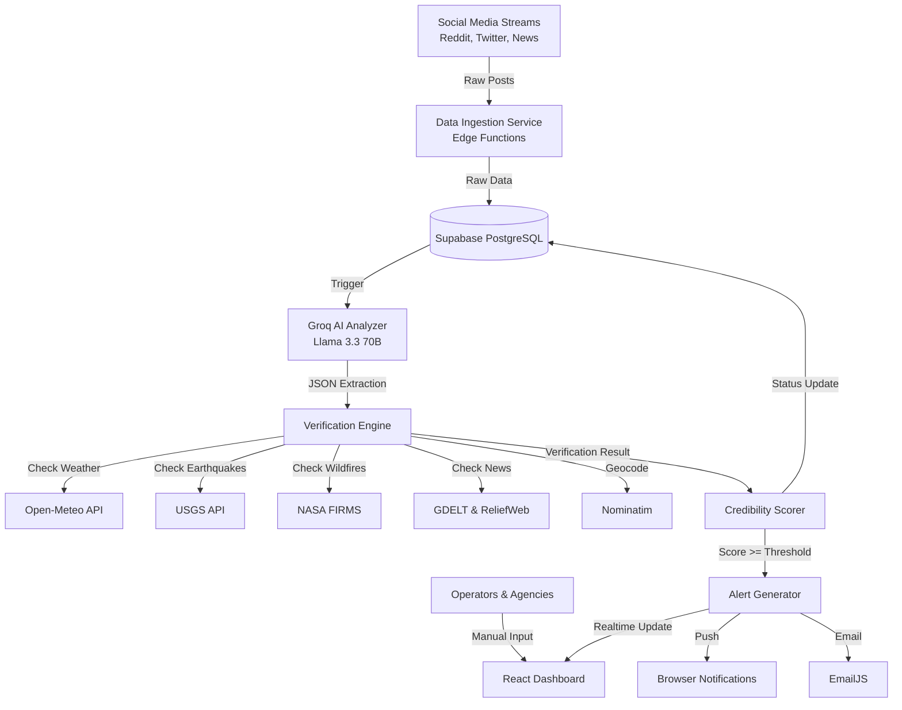

# DisasterSense AI - System Architecture

## Overview
DisasterSense AI is a full-stack, real-time disaster detection and emergency alert platform. It leverages social media data ingestion, LLM-based analysis (Llama 3.3 70B via Groq), multi-source cross-verification (Weather, Earthquakes, News), and a robust credibility scoring algorithm.

## High-Level Architecture Diagram

## Core Components
1. **Frontend (React, Vite, Zustand, Tailwind):** A dynamic, map-based command center to visualize alerts, view trends, and manually verify data.
2. **Database & Auth (Supabase):** PostgreSQL with Row Level Security (RLS). Real-time subscriptions push new alerts instantly to connected dashboards.
3. **AI Analyzer (Groq):** Uses a sophisticated prompt to parse unstructured text into highly structured JSON (disaster type, location, severity, summary).
4. **Verification Engine:** Connects to free public APIs to cross-reference the AI's findings.
5. **Credibility Scorer:** A weighted algorithmic model combining AI confidence, hardware sensor matches (weather/quakes), official news reports, and multi-source corroboration.
